# Корональные дыры (SDO 211Å) × BTC: разрезы, честная статистика, экстраполяции

*Автоотчёт `run.py` от 05.07.2026. CH — sinp_qlookdata.txt (реальная почасовая выгрузка SINP → дневные средние); BTC — btc_export.csv (биржевые данные).*

> **Коротко:** слабое сходство есть, но оно не пережило проверок: совпадают только плавные изгибы, в половинах года связь не воспроизводится, и простая синусоида «коррелирует» не хуже Солнца. Подробности — ниже, человеческим языком — в сводке в самом конце.

Дневных пар: **317** (8 авг – 7 май: 273; 23 май – 5 июл: 44). Лаг k>0 = площадь КД опережает BTC на k дней.

> Проверка ручной оцифровки скриншотов против реальной выгрузки: RMSE **2.31 п.п.** — оценки погрешности в data/README.md честные.

> Оцифровка BTC (свечи + новостные якоря) против биржевых данных: RMSE **$2,017** (max $7,577) на 127 днях — заявленная точность ±1–2% подтвердилась; теперь всюду используются биржевые цены.

## 0. Данные и их плотность (про «сжатие» на сайте)

Файл SINP: **07.07.2025 – 05.07.2026**, кадентность строго почасовая (24 записи/сутки). «Сжатие», которое видно на сайте — когда 3 дня растягиваются или месяц сплющивается — это **поведение экранного графика**: при широком диапазоне дат он усредняет и прореживает точки (data grouping в Highcharts), пики сглаживаются, а разрывы стягиваются. На исследование это не влияет: мы берём сырые почасовые строки файла и усредняем к календарным суткам — каждая точка жёстко привязана к своей дате.

| месяц | дней с данными CH-211 | почасовых записей |
|---|---|---|
| 2025-07 | 25 | 580 |
| 2025-08 | 31 | 720 |
| 2025-09 | 30 | 705 |
| 2025-10 | 31 | 725 |
| 2025-11 | 30 | 708 |
| 2025-12 | 31 | 695 |
| 2026-01 | 31 | 575 |
| 2026-02 | 28 | 650 |
| 2026-03 | 31 | 616 |
| 2026-04 | 30 | 675 |
| 2026-05 | 16 | 309 |
| 2026-06 | 30 | 717 |
| 2026-07 | 5 | 94 |

## 1. Обзор

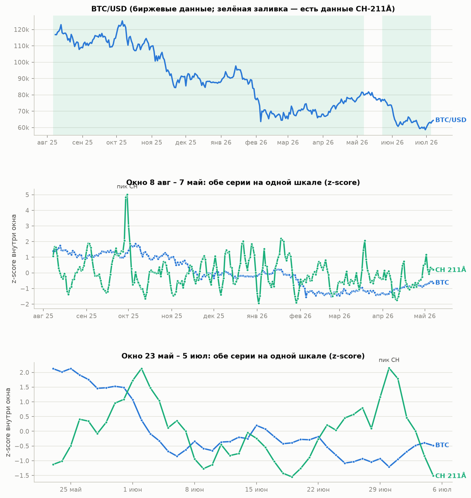

## 2. Лаг-скан по разрезам

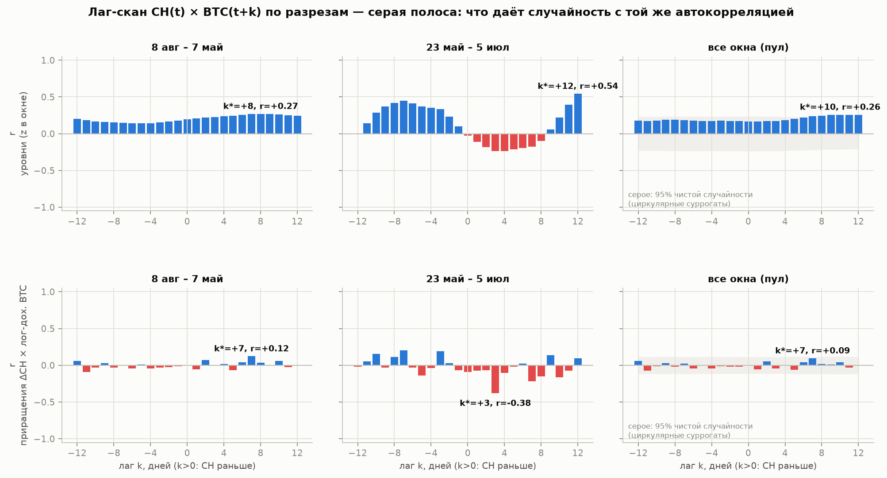

| разрез | масштаб | лучший лаг | r | n |
|---|---|---|---|---|
| уровни (z) | 8 авг – 7 май | +8 дн | +0.27 | 265 |
| уровни (z) | 23 май – 5 июл | +12 дн | +0.54 | 32 |
| уровни (z) | **пул** | +10 дн | +0.26 | 297 |
| уровни, MA(3) | 8 авг – 7 май | +8 дн | +0.29 | 265 |
| уровни, MA(3) | 23 май – 5 июл | +12 дн | +0.61 | 32 |
| уровни, MA(3) | **пул** | +11 дн | +0.28 | 295 |
| приращения | 8 авг – 7 май | +7 дн | +0.12 | 265 |
| приращения | 23 май – 5 июл | +3 дн | -0.38 | 40 |
| приращения | **пул** | +7 дн | +0.09 | 301 |

## 3. Честная статистика (главный раздел)

**Уровни**: лучший лаг k*=+10 дн, r=+0.26 (90% CI блочного бутстрэпа +0.06…+0.40), N=297.
- эффективный N с учётом автокорреляции ≈ 74 ⇒ p ≈ 0.026;
- циркулярные суррогаты (автокорреляция сохранена, выравнивание разрушено, 3000 итер.): 95-й процентиль max|r| по скану = 0.27; наблюдаемое max|r| = 0.26 ⇒ **p(всего скана) ≈ 0.070**.

**Приращения**: лучший лаг k*=+7 дн, r=+0.09 (90% CI блочного бутстрэпа -0.01…+0.18), N=301.
- эффективный N с учётом автокорреляции ≈ 301 ⇒ p ≈ 0.101;
- циркулярные суррогаты (автокорреляция сохранена, выравнивание разрушено, 3000 итер.): 95-й процентиль max|r| по скану = 0.16; наблюдаемое max|r| = 0.09 ⇒ **p(всего скана) ≈ 0.953**.

**Проверка «вау-цифр» отдельных окон** — каждое окно тестируется своими суррогатами (короткое окно + перебор лагов легко дают большие |r|):

| окно | разрез | k* | r | p(скан окна) |
|---|---|---|---|---|
| 8 авг – 7 май | уровни | +8 | +0.27 | 0.045 |
| 8 авг – 7 май | приращения | +7 | +0.12 | 0.516 |
| 23 май – 5 июл | уровни | +12 | +0.54 | 0.835 |
| 23 май – 5 июл | приращения | +3 | -0.38 | 0.949 |

Самая яркая цифра (r=+0.27, k=+8, окно 8 авг – 7 май) даёт p≈0.045 в своём окне, но: (а) проверок было 4, поправка Бонферрони ⇒ p≈0.18; (б) в соседнем окне знак у похожих лагов противоположный; (в) лаг на краю скана. Это профиль случайной находки — статус «интересно, перепроверить на 6+ месяцах», а не «связь установлена».

### Допрос главного подозреваемого: уровни, сдвиг k=+10 дн

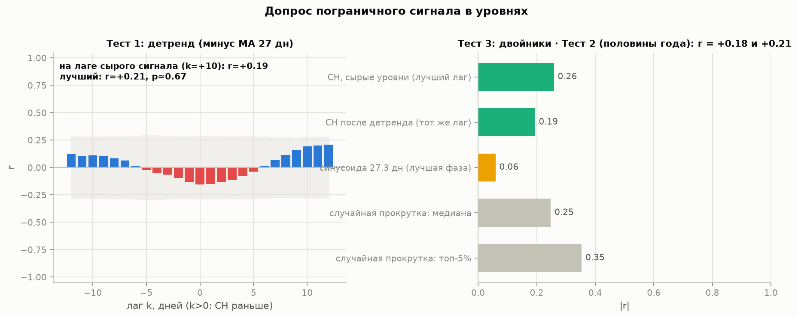

Сырые уровни дали r=+0.26 на лаге +10 дн с p(скана)≈0.07 — на грани. Три решающих теста:

1. **Детренд** (минус скользящее среднее 27 дн): r=+0.19, p≈0.67 — ослабла, формально не значима.
2. **Первая половина** (08.08–13.01, n=159): на том же лаге r=+0.18; лучший по скану r=+0.18 (k=+10), p≈0.36.
2. **Вторая половина** (14.01–05.07, n=158): на том же лаге r=+0.21; лучший по скану r=+0.35 (k=-3), p≈0.27.
   Знак совпадает в обеих половинах — очко в пользу сигнала.
3. **Синусоида-двойник** (период 27.27 дн, лучшая фаза): |r|=0.06 — заметно слабее Солнца — сигнал не сводится к чистому ритму.

**Вердикт допроса:** сигнал не пережил проверок — рабочая гипотеза «совпадение медленных волн + 27-дневный ритм», а не связь.

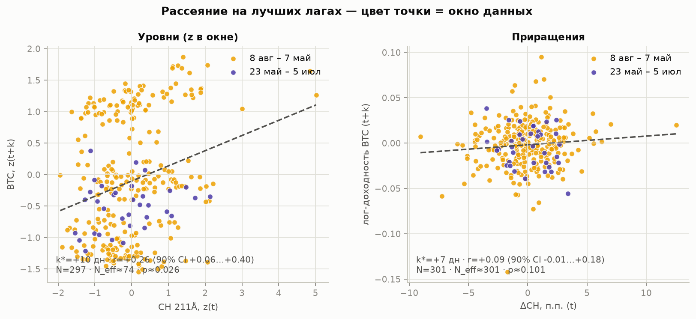

## 4. Стабильность знака

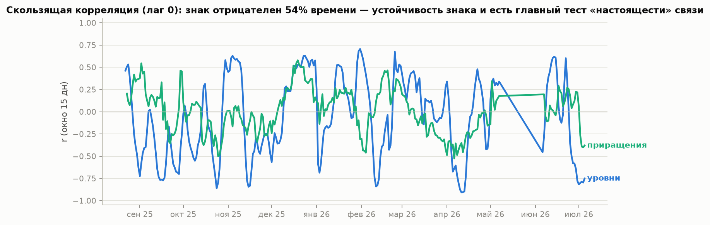

Скользящая корреляция уровней отрицательна 54% времени. У настоящей связи знак держится; у совпадения — гуляет.

## 5. Событийный разрез

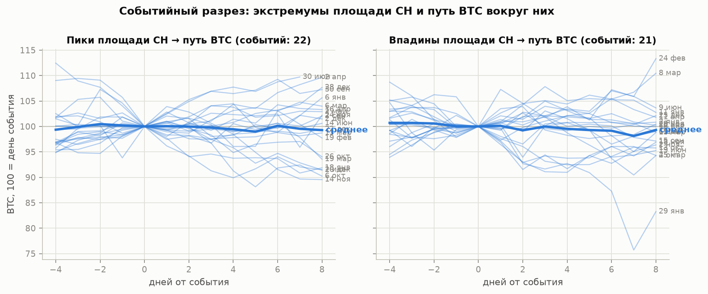

| дата | тип | CH, % диска |
|---|---|---|
| 19.08.2025 | впадина | 5.1 |
| 02.09.2025 | пик | 19.8 |
| 15.09.2025 | впадина | 5.6 |
| 30.09.2025 | пик | 33.9 |
| 04.10.2025 | впадина | 7.9 |
| 06.10.2025 | пик | 11.5 |
| 13.10.2025 | впадина | 3.9 |
| 26.10.2025 | пик | 14.5 |
| 02.11.2025 | впадина | 4.7 |
| 14.11.2025 | пик | 13.4 |
| 18.11.2025 | впадина | 8.3 |
| 24.11.2025 | пик | 16.2 |
| 29.11.2025 | впадина | 7.9 |
| 02.12.2025 | пик | 16.1 |
| 06.12.2025 | впадина | 5.0 |
| 10.12.2025 | пик | 17.8 |
| 16.12.2025 | впадина | 8.1 |
| 22.12.2025 | пик | 20.4 |
| 25.12.2025 | впадина | 12.1 |
| 28.12.2025 | пик | 19.6 |
| 02.01.2026 | впадина | 2.5 |
| 06.01.2026 | пик | 18.2 |
| 11.01.2026 | впадина | 7.2 |
| 18.01.2026 | пик | 21.2 |
| 29.01.2026 | впадина | 2.7 |
| 19.02.2026 | пик | 14.9 |
| 24.02.2026 | впадина | 4.6 |
| 06.03.2026 | пик | 11.6 |
| 08.03.2026 | впадина | 7.8 |
| 13.03.2026 | пик | 11.3 |
| 15.03.2026 | впадина | 6.5 |
| 19.03.2026 | пик | 20.5 |
| 25.03.2026 | впадина | 8.2 |
| 02.04.2026 | пик | 11.9 |
| 11.04.2026 | впадина | 3.4 |
| 16.04.2026 | пик | 14.6 |
| 20.04.2026 | впадина | 6.5 |
| 02.05.2026 | пик | 16.5 |
| 02.06.2026 | пик | 19.5 |
| 09.06.2026 | впадина | 6.8 |
| 14.06.2026 | пик | 11.3 |
| 19.06.2026 | впадина | 5.7 |
| 30.06.2026 | пик | 19.6 |

## 6. Позитивный контроль: CH × скорость солнечного ветра

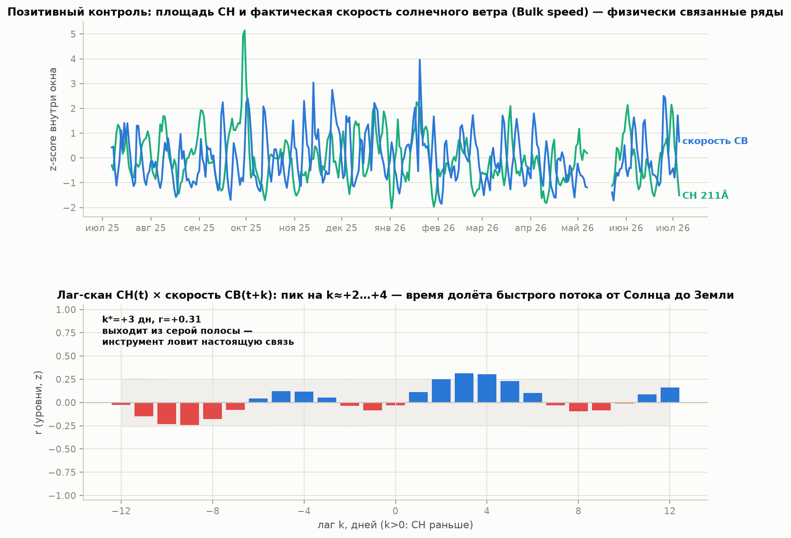

Тот же инструмент на физически связанной паре (343 дней): k*=+3 дн, r=+0.31, p(скана) ≈ 0.048. Лаг +2…+4 дня — учебное время долёта быстрого потока от Солнца до Земли, величина r совпадает с публикациями. Обратите внимание: даже **настоящая** физическая связь проходит порог 0.05 лишь впритык — вот насколько строг честный тест. Сравните с разделом 3.

## 7. Разрез «с растяжением времени» (как на накладке из TradingView)

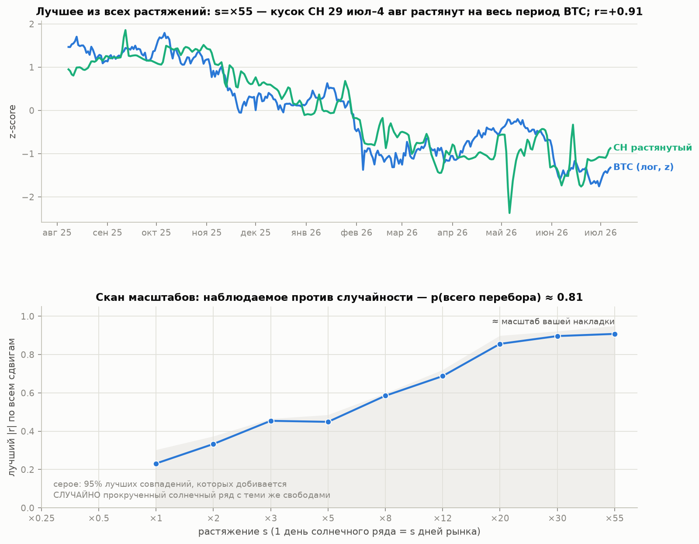

Формализуем приём «кусок солнечного ряда растягивается на месяцы рынка»: перебраны масштабы ×0.25…×55 и все сдвиги куска по году данных. Лучшее совпадение: s=×55 (кусок CH длиной 6.1 дн от 29.07.2025), r=+0.91. Но случайно прокрученный солнечный ряд при том же переборе достигает max|r| с медианой 0.92 — наблюдаемое даёт **p ≈ 0.81**. Вывод: растяжение — это не разрез, в котором связь «проявляется», а генератор гарантированных совпадений: подходящий кусок находится у случайного ряда почти всегда.

## 8. Многомасштабный разрез: а правда ли «4 часа коррелируют лучше»?

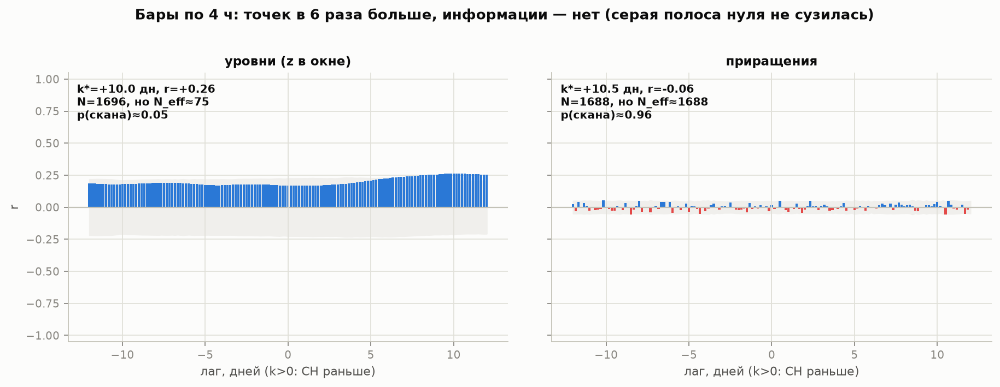

| бары | разрез | k* | r | N | N_eff | p(скан) |
|---|---|---|---|---|---|---|
| 1 день | уровни | +10 дн | +0.26 | 297 | 74 | 0.07 |
| 4 часа | уровни | +10.0 дн | +0.26 | 1696 | 75 | 0.05 |
| 1 день | приращения | +7 дн | +0.09 | 301 | 301 | 0.95 |
| 4 часа | приращения | +10.5 дн | -0.06 | 1688 | 1688 | 0.96 |

Мелкие бары дают в 6 раз больше точек, но у гладких рядов информация растёт со **сроком наблюдений**, а не с частотой нарезки: эффективный N почти не меняется, серая полоса случайности не сужается. Если на 4-часовиках связь «выглядит лучше», это о графике, не о данных.

## 9. Решающий тест: предсказывает ли Солнце биткоин (вне выборки)

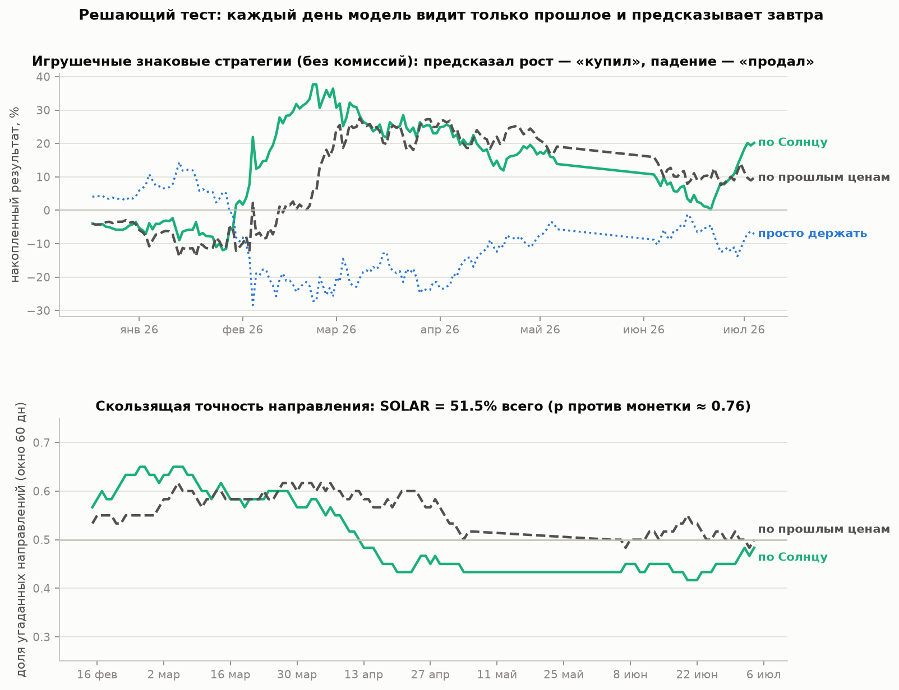

Инженерная постановка, без спора о природе рынка: если воздействие Солнца существует, оно обязано оставлять след, который улучшает предсказание. Каждый день модель обучается **только на прошлом** и предсказывает доходность следующего дня. SOLAR видит только солнечные признаки (ΔCH за 12 дней + уровень площади), AR — только прошлые движения самой цены (Солнца не видит), ZERO — «завтра как сегодня».

| модель | угадано направление | p против монетки | skill vs ZERO |
|---|---|---|---|
| SOLAR | 51.5% (из 171) | 0.76 | -0.072 |
| AR | 54.4% (из 171) | 0.28 | -0.034 |

Предсказательной силы у солнечных признаков не обнаружено: направление угадывается как монеткой, ошибка не меньше, чем у модели «завтра как сегодня». В инженерной постановке это и есть ответ задачи на текущих данных.

## 10. Экстраполяции

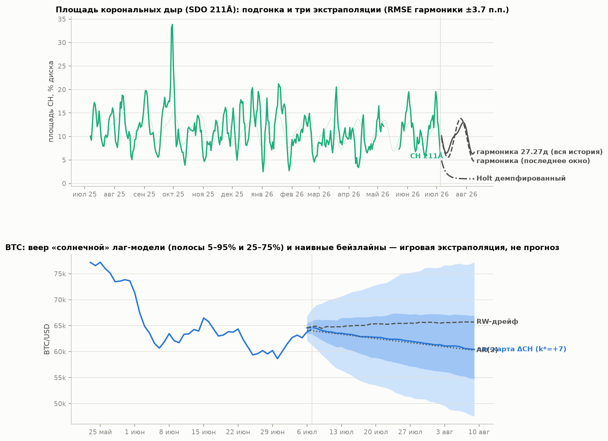

- Лаг-карта: btc_ret(t) = -0.0018 +0.0010·ΔCH(t−7) (n=301); будущие ΔCH — из гармоники 27.27 дн.
- Горизонт 35 дн от 05.07.2026: медиана лаг-модели **$60,418** (5–95%: $47,505…$77,237); RW-дрейф $65,716; AR(2) $60,265.

> Игровая экстраполяция для сравнения форм моделей. Не прогноз и не инвестиционная рекомендация.

---

## Сводка простым языком

**Как поставлена задача.** Мы не спорим о том, чем управляется рынок — манипуляция там или нет, неважно. Логика простая: солнечная активность — внешняя сила, её никто на бирже не назначает. Если она воздействует на цену, воздействие обязано оставлять след в данных. След ищем двумя способами: совпадение форм графиков и — решающий способ — предсказание: модель, которая видит только солнечное прошлое, должна угадывать завтрашний ход цены чаще, чем монетка.

**Сходство есть, и мы его видим так же, как вы.** За год данных (317 общих дней, биржевые цены) лучшее совпадение форм: если сдвинуть график дыр на +10 дней, он повторяет биткоин с силой r=+0.26 (0 — ничего общего, 1 — близнецы). Это немало для глаза — и это ровно то «сходство», которое видно на наложенных графиках. Дальше вопрос один: это след воздействия или совпадение?

**Допрос сходства (три теста).** Первый, главный: убираем из обоих графиков медленные многомесячные волны — остаётся r=+0.19 при p≈0.67 — неотличимо от случайности: бОльшую часть сходства делали плавные многомесячные волны, а они в каком-то виде совпадают у любых двух гладких кривых. Второй: режем год пополам и проверяем половины порознь — знак одинаковый в обеих (+0.18 и +0.21) — слабое очко «за», хотя каждая цифра по отдельности объяснима случайностью. Третий: заменяем Солнце «пустышкой» — синусоидой с периодом 27 дней (столько Солнце оборачивается вокруг оси) — пустышка даёт лишь r=0.06 — сходство не сводится к чистому ритму, оно живёт в медленных волнах именно этого года. Счёт неоднозначный — поэтому решает следующий тест.

**Решающий тест — предсказание.** Модель каждый день видела только прошлое и предсказывала завтрашний ход. Солнечная модель угадала направление в 51% случаев из 171 (монетка даёт 50%, вероятность получить такое случайно — 76%); модель без Солнца, только на прошлых ценах — 54%. Ни та, ни другая не лучше монетки. Если бы воздействие Солнца существовало в силе, видимой на графиках, здесь оно обязано было проявиться — его нет.

**Инструмент зрячий, мы проверили.** Та же программа находит настоящую физическую связь в этих же данных: выросли дыры → через ~3 дня у Земли ускоряется солнечный ветер (r=+0.31). Известная физика видна; связь с ценой такой же силы мы бы не пропустили.

**Про приёмы с графиками.** Растяжение куска солнечного ряда на месяцы рынка даёт красивые совпадения (до r≈0.9), но случайная пустышка при тех же свободах добивается того же в большинстве попыток — растяжение производит совпадения гарантированно. 4-часовые бары: точек в 6 раз больше (1696 против 297), а независимой информации столько же — сосед повторяет соседа, и честный вывод не меняется.

**Погода на Солнце.** Следующий пик площади дыр по 27-дневному ритму — около **29.07.2026**. Если хотите продолжать наблюдение: обновляйте оба файла данных раз в месяц и перезапускайте `python run.py` — смотреть надо на раздел 9 (предсказание) и раздел 3 (допрос).

**Итог одной строкой.** Сходство на графиках настоящее, но его несут медленные волны конкретного года, а не устойчивый механизм: как только модель обязана предсказывать завтра, не подглядывая, солнечные данные не дают ничего — строить торговую логику от Солнца на этих данных нельзя.
